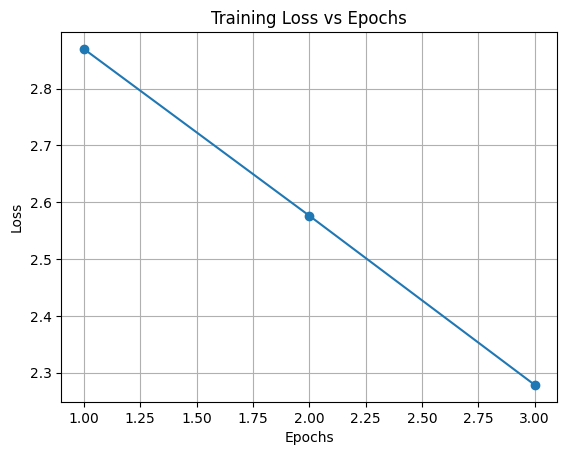
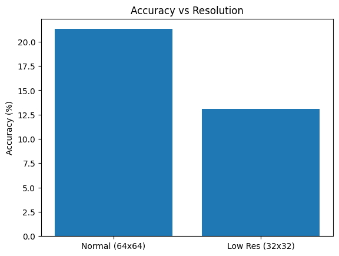

# Cross-Resolution Consistency Learning for Image Classification

## Overview

In many real-world scenarios, images are not always available at the same resolution. A model trained on high-quality images may perform poorly when given lower-resolution inputs. This project explores how to make an image classification model more robust to such variations.

The main idea is to train a model so that it produces consistent predictions even when the same image is presented at different resolutions.

---

## Objective

The objective of this project is to train a deep learning model that maintains stable predictions when the resolution of the input image changes. In simple terms, the model should give similar outputs for both high-resolution and low-resolution versions of the same image.

---

## Dataset

This project uses the Tiny ImageNet dataset, which contains 200 image classes.

Dataset link:  
http://cs231n.stanford.edu/tiny-imagenet-200.zip

---

## Methodology

The approach used in this project consists of three main steps: generating multi-resolution inputs, training the model, and enforcing prediction consistency.

### Multi-Resolution Input

Instead of using a single version of each image, multiple resized versions are created. For each image:

- A high-resolution version (64×64)
- A low-resolution version (32×32)

Both versions contain the same object but differ in visual clarity.

---

### Model Architecture

A ResNet18 model is used for image classification. It is a standard convolutional neural network that performs well on image tasks.

The same model processes both high-resolution and low-resolution images.

---

### Training Strategy

During training, both versions of the same image are passed through the model. This produces two predictions.

Two types of loss are used:

**1. Classification Loss**  
This is the standard cross-entropy loss that ensures the model predicts the correct class.

**2. Consistency Loss**  
This measures how different the predictions are for the two resolutions. It is implemented using KL divergence.  
The goal is to make predictions as similar as possible across resolutions.

The final loss is a combination of both, allowing the model to learn accuracy and consistency together.

---

## Evaluation

The model is evaluated in two ways:

- Accuracy on normal resolution images (64×64)
- Accuracy on low-resolution images (32×32)

This helps us understand how well the model generalizes across different image qualities.

---

## Results

The training loss decreases steadily over epochs, which shows that the model is learning.

However, the accuracy results show:

- Higher accuracy on normal resolution images  
- Lower accuracy on low-resolution images  

This indicates that maintaining performance across resolutions is a challenging problem.

---

## Graphs

### Training Loss vs Epochs

---

### Accuracy vs Resolution

---

## Observations

- The model is able to learn useful patterns from the data.
- There is a clear drop in performance when the resolution decreases.
- The consistency loss helps guide the model, but further improvements are possible.

---

## Future Improvements

- Train the model for more epochs
- Adjust the weight of the consistency loss
- Add more resolution levels such as 16×16
- Use more advanced architectures like ResNet50 or Vision Transformers

---

## Tech Stack

- Python  
- PyTorch  
- Torchvision  
- TIMM  
- Matplotlib  

---

## Files Included

- Project.ipynb → Main implementation  
- graph1.png → Accuracy graph  
- graph2.png → Loss graph  

Note: The trained model file is not uploaded due to size limitations. It can be generated by running the notebook.

---

## Conclusion

This project demonstrates a simple and practical approach to improving model robustness across different image resolutions. While the model still shows reduced performance at lower resolutions, the methodology provides a strong foundation for handling such challenges in real-world applications.

---

